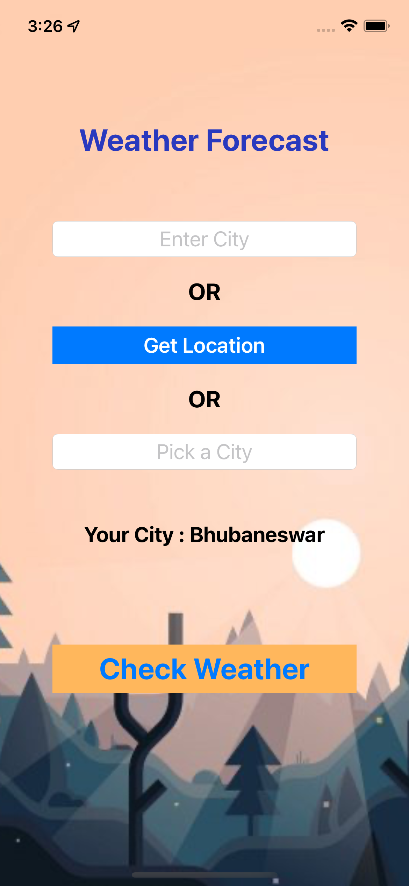
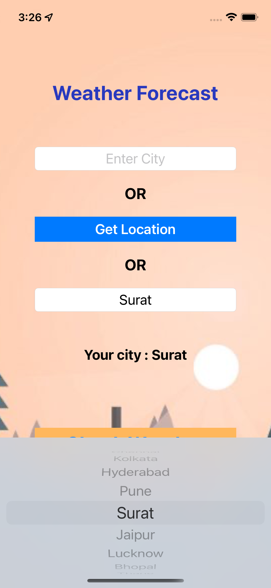
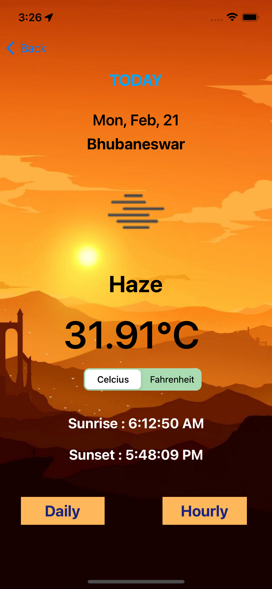
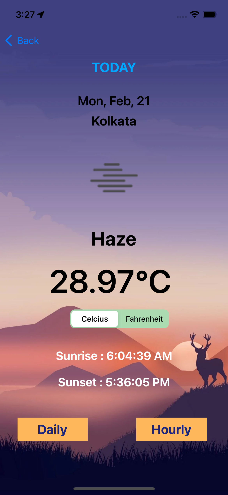
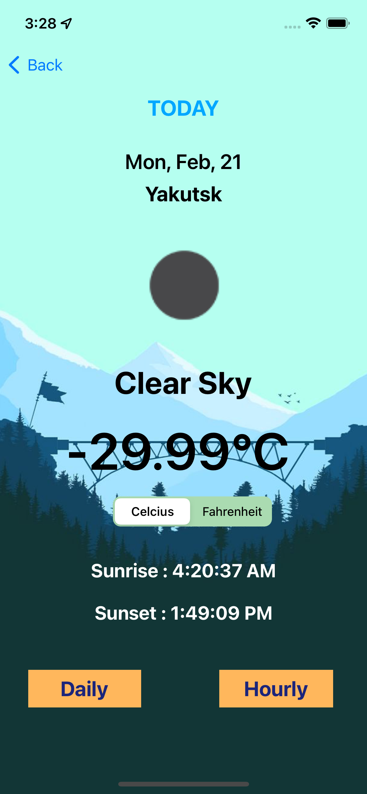
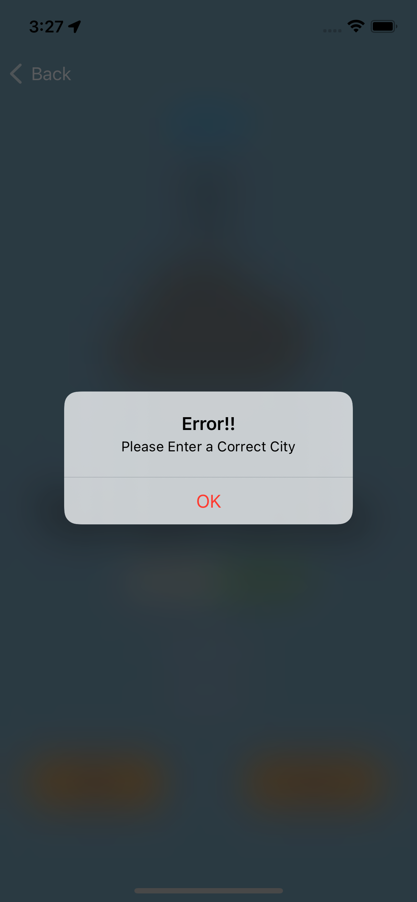
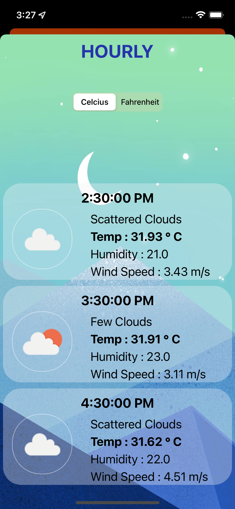
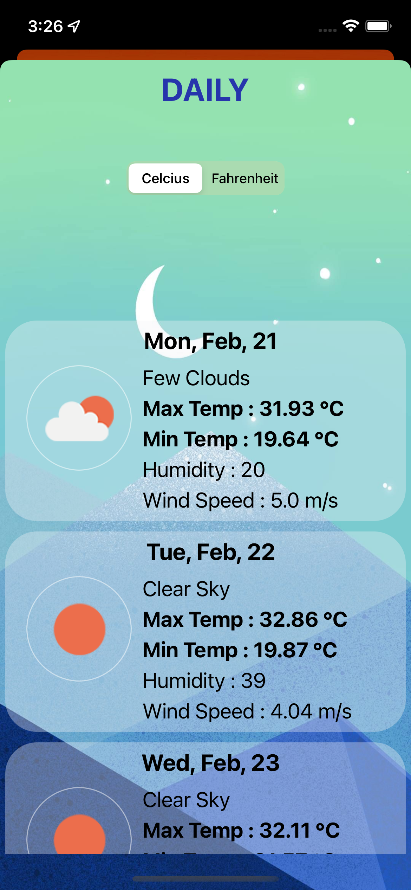

# Weather-App

## A Simple weather app to make your life easy

In this app you will get 3 different options to select your location. Once you select a location and enter the Check Weather Button you will get to see wether details of that particular day. You will also get two different buttons to get details of weather for next 7 days and another for next 24 hours.


### Make sure to add your api in AFUtility File  (Project -> Model -> AFUtility)

## Framework
We have created two frameworks in our app

https://cocoapods.org/pods/weatherTime

weatherTime is available through [CocoaPods](https://cocoapods.org). To install
it, simply add the following line to your Podfile:

```ruby
pod 'weatherTime'
```


https://cocoapods.org/pods/LocationFound

LocationFound is available through [CocoaPods](https://cocoapods.org). To install
it, simply add the following line to your Podfile:

```ruby
pod 'LocationFound'
```


## Demo
<p align="center">
  
  
  
  
  
  
  
  
</p>

<p align="center"> 
  Show some ❤️ by starring the repository!
</p>

<div align='center'>
 
[](https://forthebadge.com) 
[](https://forthebadge.com) 
[](https://forthebadge.com)
 
</div>
